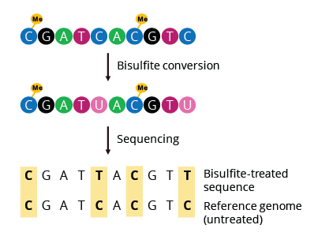

## Overview
In examining the diversity of life, we're often directed to the sequence of an organism's DNA as the source of variation. Differences in these genomes are directly correlated with changes in genetic products, regulatory affects, and molecular interactions--all of which contribute to the great phenotypic variety observed in our world.

However, in this paper, we wish to look beyond the genome. Instead, we introduce the topic of epigenomics, the analysis of gene expression that is not attributable to mutations to the DNA sequence of a genome. Rather, epigenetic expression alteration is caused by biochemical interactions with various proteins and other compounds.

We will describe the biology of the two most well-known epigenomic modifications: [DNA Methylation](#Biology-DNA-Methylation) and [Histone Modifications](#Biology-Histone-Modifications). Then, we will describe the analytical techniques used to quantify each epigenomic modification.

## Biology: DNA Methylation
### Introduction
The first epigenomic modification was discovered as early as the identification of DNA as the genetic material by Rollin Hotchkiss in 1984: DNA methylation.

DNA Methylation is a process by which methyl group are added to DNA molecules. It's catalyzed by family of DNA methyltransferases (Dnmts), enzymes which can transfer methyl groups from S-adenosyl methionine (SAM) to the fifth carbon of a cytosine residue to form 5-methylcytosine (5mC).

### I. Location of DNA Methylation
The most of the DNA methylation happens on cytosines that precede a guanine nucleotide, which is also called CpG sites. Most of the CpG sites are heavily methylated expected for CpG island. 

In Mammals, region called CpG island is GC- and CpG-rich sequences that are not methylated. The definition of CpG region contains

1. sequence length longer than 200bp.
2. G+C contents is more than 50%.
3. a ratio of observed to expected CpG greater than 0.6.

In human genome, there are around 25,000 CpG islands, 75% of which being less than 850bp long. Around 50% of CpG islands contain transcription starting site. Also, because lots of binding sites of transcription factor are GC rich, CpG islands are considered to enhance binding of transcription factor.


## Biology: Histone Modifications
### Introduction
Histones are proteins found in eukaryotic cell nuclei that order DNA into nucleosomes. These components of chromatin are subject to post-translational modifications including methylation, acetylation, phosphorylation, ubiquitylation, and others still being researched. The histone code hypothesis suggests that these modifications to chromatin structure along with epigenetic markers influence the recruitment of proteins responsible for regulating gene expression. Multiple modifications work together simultaneously to regulate and change chromatin state and gene expression.


General structure of a DNA-histone complex. The two most common modifications (acetylation) and (methylation) are shown.

### I. Histone Acetylation
Acetylation connects a negative charge acetyl group to lysine residues of the N-terminal histone tails (specifically H3 and H4) by histone acetyltransferase (HAT). By doing so, negatively charged DNA is repelled, causing the chromatin to relax into euchromatin and allow for transcription factors to bind and increase gene expression. Deacetylation by histone deacetylase (HDAC) however condenses chromatin into heterochromatin, therefore deactivating gene activity.

<br />


Acetylation of histones, leading to relaxation of DNA into euchromatin. Note the larger regions of exposed DNA open for transcription after acetylation.

### II. Histone Methylation/Demethylation
Unlike histone acetylation, methylation is a post-translational epigenetic modification that does not directly change histone charge or histone-DNA interactions. Instead, a methyl group is added to lysine or arginine residues of histone tails, each impacting transcription differently. Arginine methylation activates transcription and transcriptional activities, while Lysine methylation’s effect depends on the methylation site and length. Methylation of sites such as H3K4, K36, and K79 result in transcriptional activation, while methylation of H3K9, K27, and H4K20 silence gene activity/expression. 


Add methylation image with name specified in raw md into assets folder.

### III. Histone Phosphorylation
Unique from histone methylation and acetylation, histone phosphorylation employs interaction between other histone modifications and binding proteins. Chromatin remodeling happens by attaching a phosphoryl group to histone tails, occuring on all histone core proteins, having distinct effects on each. This process plays a huge role in cell division, transcriptional regulation, and DNA damage repair. 


One example of histone phosphorylation. Various possible signals caused by this particular phosphorylation are described.

## Analysis Techniques: DNA Methylation
### Background
The goal of DNA Methylation analysis is fairly obvious: we wish to detect what parts of the genome are methylated to identify, confirm, or analyze downregulated regions.

Let's take an example: We have two bacterial samples that should both be expressing a gene that turns them blue. However, one culture appears blue while the other appears white. Given what we've learned, we may hypothesize that, for some reason, the white colony of bacteria have methylated the region containing the gene, thus downregulating it. How can we test this hypothesis?

Indeed, genetic sequencing shows the DNA sequence of both bacteria to be identical, yet the white colony shows little to no transcription of this gene. What we've just mentioned sets the context for DNA methylation analysis: **genetic sequencing is unable to distinguish methylated and non-methylated cytosine**. Therefore, we require other analysis technqiues, one that allows us to differentiate between these two:

### I. Bisulfite Sequencing
#### Overview
Bisulfite sequencing is the most widely-used and popular DNA Methylation analysis technique. The core idea is to convert non-methylated cytosine into uracil, but keep methylated cytosine unchanged. Then, run a sequencing analysis. The converted cytosine (now uracil) will be detected during sequencing as thymine, so every detected cytosine will be a methylated cytosine, giving a clear indication of which regions are methylated.

  
The conversion of non-methylated cytosine into uracil, which are read as thymines by sequencing technology. Notice that methylated cytosine are unchanged and remain sequenced as cytosines.

#### Lab Technique
The first milestone in a bisulfite sequencing analysis is the treatment of DNA with [bisulfite](https://en.wikipedia.org/wiki/Bisulfite). There are three major steps in this protocol:

1. Denaturation of DNA into single strands.
2. Incubation with bisulfite solution at high temperature.
3. Cleaning of DNA; removal of bisulfite and residues

The product of this will be DNA with non-methylated cytosine converted into uracil. Although [whole genome bisulfite sequencing](https://en.wikipedia.org/wiki/Whole_genome_bisulfite_sequencing) (WGBS) is becoming increasingly viable, it is not yet a common method. Thus, we will only describe the lab technique for region-specific analysis. However, we will mention one WGBS analysis method [below](#Bonus---Whole-Genome-Bisulfite-Sequencing-Analysis).

Having used bisulfite to convert all non-methylated cytosine to uracil, the next step is to use a [Polymerase Chain Reaction](https://en.wikipedia.org/wiki/Polymerase_chain_reaction) (PCR) to amplify the region of interest. Traditionally, primers must be selected carefully (such as selecting for low cytosine or non-CpG island rich areas) so potentially converted cytosine do not inhibit PCR amplification. Additionally, in parallel, a PCR for the same region is run on DNA that has *not* been treated with bisulfite.

Both PCR products (bisulfite-treated and native DNA) are cleaned and sequenced using any modern sequencing technique. This yields two digital sequence files:
1. A bisulfite-treated sequence where each cytosine is a methylated cytosine.
2. A native DNA sequence that is true to the original sequence. 

We now move to computational analyses conducted on these data files.

#### Computational Analysis
The simplest analysis possible with these two files is aligning the two sequences, and identifying where there is a C-T mismatch. For example, take the two sequences below:
```
Bisulfite:  GTATCTAT
Native:     GCATCTAC
```

We see the bisulfite sequence identifies the cytosines at positions 2 and 9 as thymines, but the cytosine at position 5 remains a cytosine. We would conclue that the cytosines at positions 2 and 9 were not methylated, while the cytosine at position 2 was.

A related but more interesting analysis than a base-by-base comparison is one that answers, "What areas of this region of interest are methylation-rich?" Tools such as [MethylCoder](https://github.com/brentp/methylcode) provide the answer by aggeregating the results of the base-by-base comparison, determining locales with high aggregate values, and reporting the raw and aggregated results.

#### Bonus - Whole Genome Bisulfite Sequencing Analysis
The quintessential question asked of WGBS is, "What regions of the whole genome are methylation-rich?" Here, the data required for analysis are slightly different than before:

1. Bisulfite sequencing data (FASTQ)
2. Reference genome of interest (FASTA)

Recently developed [EPIC TABSAT](https://tabsat.ait.ac.at/) is one excellent tool for such an analysis. Given these inputs, the following general analysis steps are performed:

1. Quality assessment of raw data
2. Read alignment to reference genome
3. Methylation site analysis and grouping

The tool will then output information about methylation-rich sites, relative methylation level, and more (shown below).


Summary of various data outputs by EPIC TABSAT (click above for clearer image). Note in particular 1) the lollipop plot that shows % methylation arranged according to samples' accurate chromosomal coordinates and 2) the patternmap showing methylation significance by sample.

### II. HELP Assay
#### Overview
The HpaII tiny fragment Enrichment by Ligation-mediated PCR (HELP) Assay leverages restriction enzyme digestion analysis to determine DNA methylation patterns.

More to come--researching!
#### Lab Technique
More to come--researching!

#### Computational Analyses
More to come--researching!

### Challenges
The key limitation of DNA methylation analysis techniques is that any given result is only a snapshot of a single cell at a given point in time. This means repeating an experiment on the same organism may yield vastly different results given that a different cell in a different point in time is used. 

A better method would be one that uses continual measurement of methylation instead of endpoint analysis; this way, we may get a better glimpse into the dynamic mechanisms of true genomic methylation. Such tools and techniques are being developed today.

## Analysis Techniques: Histone Modifications
### Background
More to come--researching!

## Citations
1. [Darst, Russell P et al. “Bisulfite sequencing of DNA.” Current protocols in molecular biology vol. Chapter 7 (2010): Unit 7.9.1-17. doi:10.1002/0471142727.mb0709s91.](https://www.ncbi.nlm.nih.gov/pmc/articles/PMC3214597/#S2title)  
2. [Kurdyukov, Sergey, and Martyn Bullock. “DNA Methylation Analysis: Choosing the Right Method.” Biology vol. 5,1 3. 6 Jan. 2016, doi:10.3390/biology5010003.](https://www.ncbi.nlm.nih.gov/pmc/articles/PMC4810160/)  
3. [Oda, Mayumi, and John M. Greally. “The Help Assay.” Methods in Molecular Biology DNA Methylation, 2009, pp. 77–87., doi:10.1007/978-1-59745-522-0_7.](https://link.springer.com/10.1007/978-1-59745-522-0_7)
4. [Gardiner-Garden M, Frommer M. "CpG islands in vertebrate genomes". Journal of Molecular Biology. 196 (2): 261–82. July 1987. doi:10.1016/0022-2836(87)90689-9.](https://www.sciencedirect.com/science/article/pii/0022283687906899?via%3Dihub)
